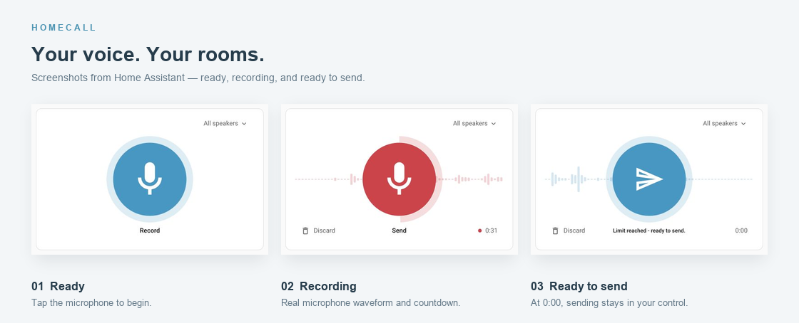
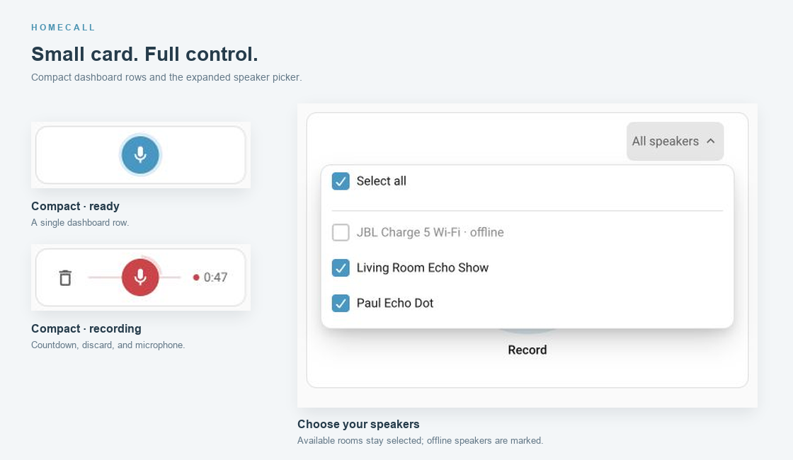
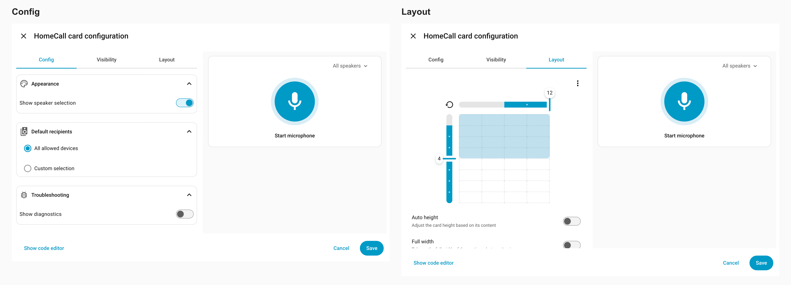

<p align="center">
<a href="https://github.com/thomasgregg/homecall-card/actions/workflows/ci.yml"></a>
<a href="LICENSE"></a>
<a href="https://hacs.xyz"></a>
</p>

**A focused recording card for original-voice announcements to your speakers.**

Choose the rooms. Start the microphone, wait until it is ready, then speak and tap to send. HomeCall Card gives Home Assistant a responsive microphone interface with a waveform, recording timer, recipient picker, and clear delivery feedback. It requires the separate [HomeCall integration](https://github.com/thomasgregg/homecall).

**HomeCall supports Alexa/Echo, compatible DLNA speakers, Sonos, Music Assistant players, Google Cast and EchoMuse Dots.** Configure speakers in the integration, then select them in the card. EchoMuse playback requires HomeCall 1.6.0 or newer and Dots connected through Home Assistant’s ESPHome integration; Music Assistant is not required. The card’s recording and speaker-picker behavior is shared across platforms. See the integration’s [speaker compatibility guide](https://github.com/thomasgregg/homecall#speaker-compatibility) and [EchoMuse setup](https://github.com/thomasgregg/homecall/blob/main/docs/echomuse.md) for setup, playback behavior and hardware verification.

## Contents

- [Features](#features)
- [Screenshots](#screenshots)
- [Install](#install)
- [Everyday use](#everyday-use)
- [Configuration](#configuration)
- [Documentation](#documentation)
- [Development](#development)

## Features

- **Record and send:** mono audio capture with a 60-second limit.
- **Clear microphone readiness:** immediate preparation feedback; recording starts when input samples arrive, with no fixed wait or countdown.
- **Responsive layout:** adapts to card dimensions; compact icon-only actions stay centered.
- **Optional speaker picker:** select rooms in the card or use configured defaults.
- **Native speaker list:** each speaker shows its integration and availability on a separate line, including on mobile.
- **Stable recording controls:** discard and timer space is reserved across phases.
- **Native visual editor:** no YAML required for normal configuration.
- **Accessible feedback:** labeled controls, keyboard support, and detailed status.
- **English and German:** language follows Home Assistant.

## Screenshots

Captured in Home Assistant using the card editor’s live preview and real microphone audio.





Configure recipients, diagnostics, and card size in the visual editor.



## Install

First install and configure the [HomeCall integration](https://github.com/thomasgregg/homecall) **1.7.0 or newer**. HomeCall Card 1.3.2 uses the recorder module supplied by that integration. If your integration is older, update it first and restart Home Assistant. If you already have 1.7.0 or newer, this card update needs only a dashboard refresh. Use Home Assistant 2026.9 or newer and open the dashboard through HTTPS.

**HTTPS is required for microphone recording.** Browsers only allow microphone access from a secure page, so a dashboard opened at an ordinary HTTP address such as `http://192.168.1.10:8123` cannot record voice messages, even if you allow microphone permission. Open Home Assistant using a trusted HTTPS address, either on your local network or through an existing remote-access connection. You do not need to expose Home Assistant publicly. See the [browser microphone requirements](https://developer.mozilla.org/en-US/docs/Web/API/MediaDevices/getUserMedia#privacy_and_security).

This requirement applies to the dashboard used to record. Music Assistant and speaker audio delivery can still use local HTTP. You can also configure speakers and play the built-in test chime from the integration's HomeCall settings over HTTP.

### HACS

[](https://my.home-assistant.io/redirect/hacs_repository/?owner=thomasgregg&repository=homecall-card&category=plugin)

With HACS installed, click the button to open this custom repository in your Home Assistant instance. Add it when prompted, then choose **Download**. Install the integration and card separately.

1. Add `https://github.com/thomasgregg/homecall-card` to HACS **Custom repositories** as a **Dashboard** repository.
2. Download HomeCall Card.
3. Confirm HACS registered the JavaScript resource, refresh the dashboard, and add **HomeCall** from the card picker.

### Manual

Copy [`homecall-card.js`](homecall-card.js) to `<config>/www/homecall-card.js`. Register a JavaScript **module** resource at `/local/homecall-card.js` under **Settings → Dashboards → Resources**, then refresh the dashboard.

```yaml
type: custom:homecall-card
```

The root JavaScript file is a self-contained build. You do not need npm or a build step on Home Assistant.

## Everyday use

1. Choose speakers, if the picker is visible.
2. Tap the blue microphone and allow browser microphone access.
3. A spinner immediately replaces the microphone while it prepares. Speak when the red microphone, recording dot, and ring appear. The timer starts only once microphone samples arrive; larger cards also show **Speak now**. The outer ring fills clockwise while the timer counts down from **1:00**.
4. Tap **Send**, or use **Discard** to start again.

At **0:00**, recording stops automatically and the button switches to a smaller outlined Send icon. It never sends automatically. Press **Send** or **Discard**; larger cards also show “Limit reached - ready to send.” After a fully accepted send, the card returns to ready after five seconds and preserves speaker selection. Partial failures stay visible for review. An audio-fetch receipt confirms retrieval, not audible playback.

Unavailable or missing default recipients produce an amber warning, even with diagnostics off. The card sends the recording to the available speakers. Open the warning for details: before sending, it lists the speakers that will be skipped; afterward, it shows how many accepted the announcement and which were skipped. Partial delivery keeps the microphone action: one tap starts a fresh recording. It never resends the previous audio. A failed send shows **Retry**. Warnings and errors stay until you act on them; opened details close when clicking outside or pressing Escape.

The speaker picker uses Home Assistant's native list controls. The second line shows the integration and availability, so two routes for the same physical speaker can be distinguished. Choose one route per physical speaker to avoid duplicate announcements. **Select all** chooses the currently available routes and clears the pending skipped-recipient warning. A recovered route is not automatically reselected.

Recording review and local audio playback have been removed. Tapping Send finishes capture and sends directly; an older saved `preview_before_send` option is ignored.

## Configuration

| Option                   | Type         | Default                                              | Meaning                                                                                                                                                                    |
| ------------------------ | ------------ | ---------------------------------------------------- | -------------------------------------------------------------------------------------------------------------------------------------------------------------------------- |
| `type`                   | string       | Required                                             | `custom:homecall-card`                                                                                                                                                     |
| `show_speaker_selection` | boolean      | `true`                                               | Show the recipient picker                                                                                                                                                  |
| `default_targets`        | string array | Integration defaults, otherwise all allowed speakers | Initial selection, using allowed Alexa `notify.*_speak` or configured DLNA, Sonos, Music Assistant, Google Cast or EchoMuse `media_player.*` entity IDs; `[]` selects none |
| `show_diagnostics`       | boolean      | `false`                                              | Optional timing details under Troubleshooting in the editor; delivery warnings and errors remain available when off                                                        |
| `grid_options`           | object       | 6 columns × 1 row                                    | Standard Home Assistant sections sizing                                                                                                                                    |

```yaml
type: custom:homecall-card
show_speaker_selection: false
default_targets:
  - notify.kitchen_speak
  - notify.living_room_speak
grid_options:
  columns: 6
  rows: 1
```

Defaults never bypass the integration's allowlist. Hiding the picker also hides the ability to change rooms in the card, so verify the default targets before hiding it.

### Card sizing

In a **Sections** dashboard, HomeCall defaults to **6 columns × 1 row** (half a section wide). The minimum supported height is **56px**. Set the size in the card editor's **Layout** tab, or use `grid_options` as above. Existing cards keep their saved dimensions until you resize them.

At **1 row**, the microphone and discard icon sit at the card's middle height. The speaker icon is centered on its own until the countdown appears; then the visible icon and countdown form a centered group with a clear gap between them. When the speaker picker is hidden, the countdown and recording dot sit at middle height. The waveform leaves space around the side controls. Speaker selection and longer status messages open in popovers outside the short card.

At **2 rows or more**, the card retains its taller layout, with the picker above and recording controls below. The text speaker selector uses a slimmer touch area. The main action scales to the available space; captions appear when there is enough room, with balanced bottom spacing and clearance for two lines. These layouts use the same Home Assistant icons, fonts, controls, and theme colors.

The circle keeps the same diameter through preparation and recording for a given card size. It scales with the actual available space, so the editor preview and dashboard can differ when their widths differ. Two-row cards retain footer clearance through the 200px width boundary; window resizing preserves timer and discard alignment.

Columns control width and rows control height. For example, use `columns: 12` and `rows: 3` for a larger card. Actual width depends on the dashboard and screen size. Masonry dashboards do not use `grid_options`; use a Sections view for the explicit 6 × 1 layout.

## Documentation

| Guide                                             | Covers                                                  |
| ------------------------------------------------- | ------------------------------------------------------- |
| [Layout and configuration](docs/configuration.md) | Sizing, picker behavior, recording states, and examples |
| [Troubleshooting](docs/troubleshooting.md)        | Cached builds, microphone errors, targets, and delivery |
| [Architecture and testing](docs/architecture.md)  | Source layout, builds, cancellation, and test scope     |
| [Contributing](CONTRIBUTING.md)                   | Setup, checks, and release process                      |
| [Privacy and security](SECURITY.md)               | Browser audio lifecycle and vulnerability reports       |
| [Changelog](CHANGELOG.md)                         | Public version history                                  |

## Development

```sh
npm ci
npm run build
npm test
npx playwright install chromium webkit
npm run test:browser
npm run format:check
```

The browser suite tests the built card in Chromium and WebKit with stand-ins for native Home Assistant controls. It checks mounted configuration toggles, native speaker selection at phone widths, availability changes, preparation and cancellation, partial-delivery warnings, automatic success reset, and window resizing across recording phases. Geometry checks include centering, border insets, halo clearance, and timer/discard alignment. These tests complement a real Home Assistant visual check; they do not emulate speaker playback or validate every native frontend revision.

Licensed under [MIT](LICENSE). Built and maintained by [Thomas Gregg](https://github.com/thomasgregg).

### Optional announcement chime

HomeCall integration 1.8.0 adds **Play a chime before messages** under **HomeCall → Configure → Announcements**, disabled by default. The card still sends one recording; the integration combines the chime and message for applicable recipients. **Skip the chime on direct Google Cast speakers** is enabled by default; turn it off to include the HomeCall chime on those speakers. Music Assistant players and groups are not excluded by that setting. Native Cast connection sounds can still occur. The new chime needs hardware testing on individual routes and groups.

Card 1.3.2 is a companion documentation/version update; recording and delivery behavior are unchanged from 1.3.1.
